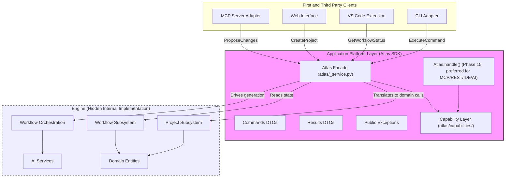

# Application Platform Diagram

See [Platform Request Dispatch Diagram](platform-request-dispatch.md) for the full Phase 15 dispatch flow, including the envelope path and the five-capability breakdown.
