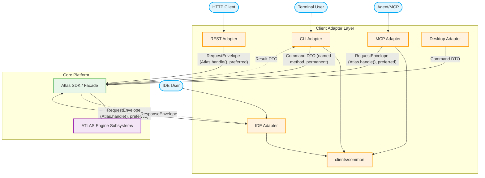

# Client Adapter Layer Diagram

This diagram shows the relationship between external environments, the client adapters, and the public ATLAS SDK.

Since Phase 15, every adapter above negotiates a `PlatformCapabilityManifest` via `negotiate(atlas)` and presents an `AdapterContext` identity, structurally satisfying `atlas.adapters.protocol.PlatformAdapter`. Only the CLI (in-process) uses named Command DTOs directly; out-of-process/protocol adapters use `Atlas.handle(RequestEnvelope)`. See [Platform Request Dispatch Diagram](platform-request-dispatch.md).
