# Domain Relationships and Traceability Chain Diagram

This diagram shows how the `Project` aggregate root owns the sub-aggregates by lightweight reference IDs, and details the traceability chain values connecting domain components.

```mermaid
graph TD
    classDef root fill:#ffecb3,stroke:#ffb300,stroke-width:3px;
    classDef aggregate fill:#e1f5fe,stroke:#0288d1,stroke-width:2px;
    classDef trace fill:#f1f8e9,stroke:#558b2f,stroke-width:1px,stroke-dasharray: 5 5;

    Project[Project Aggregate Root]:::root

    Workspace[Workspace Sub-Aggregate]:::aggregate
    Research[Research Sub-Aggregate]:::aggregate
    Planning[Planning Sub-Aggregate]:::aggregate
    Architecture[Architecture Sub-Aggregate]:::aggregate
    Workflow[Workflow Sub-Aggregate]:::aggregate
    Memory[Memory Sub-Aggregate]:::aggregate
    Evaluation[Evaluation Sub-Aggregate]:::aggregate

    Project -->|workspace_id| Workspace
    Project -->|research_id| Research
    Project -->|planning_id| Planning
    Project -->|architecture_id| Architecture
    Project -->|workflow_id| Workflow
    Project -->|memory_id| Memory
    Project -->|evaluation_ids| Evaluation

    subgraph Traceability Chain
        Evidence[Research Evidence / Source]
        Finding[Research Finding]
        Opportunity[Opportunity]
        Task[Planning Task]
        ADR[Architecture ADR / Component]
        Spec[Engineering Specification]
        Audit[Evaluation / Review Audit]

        Finding -.->|TraceabilityLink: source_id| Evidence
        Opportunity -.->|TraceabilityLink: source_id| Finding
        Task -.->|TraceabilityLink: source_id| Opportunity
        ADR -.->|TraceabilityLink: source_id| Task
        Spec -.->|Refers to| ADR
        Audit -.->|Validates spec vs code| Spec
    end
```

