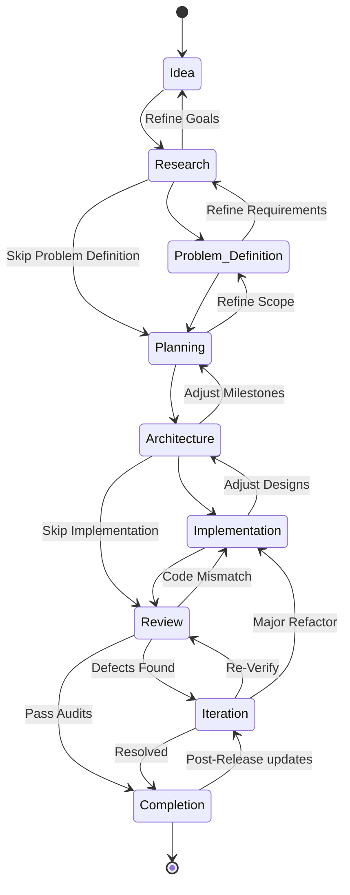

# Engineering Pipeline Diagram

This state diagram represents the chronological progression through the engineering lifecycle stages, showing both the standard forward path and valid backward iteration loops.

Matches `WorkflowTransitionService.VALID_TRANSITIONS` exactly (`engine/workflow/services.py`)
-- Problem_Definition and Implementation have no AI `StageExecutor`, so
Research and Architecture also have direct shortcut edges to Planning and
Review respectively, letting a project skip them entirely as optional
manual detours rather than mandatory waypoints.

