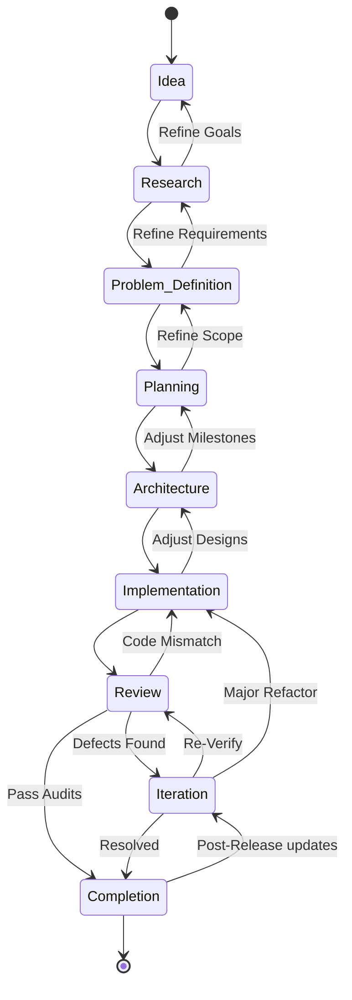

# Engineering Pipeline Diagram

This state diagram represents the chronological progression through the engineering lifecycle stages, showing both the standard forward path and valid backward iteration loops.

