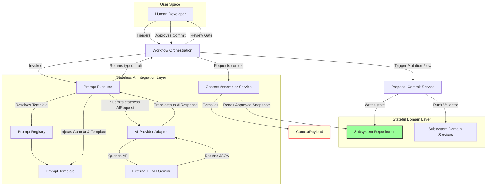

# Intelligence Layer Boundary Diagram

This diagram shows the stateless AI boundaries and context aggregation layers, illustrating that the AI Orchestration layer only reads data and cannot directly write to subsystem repositories. State changes must flow through the human review gate and commit services.

