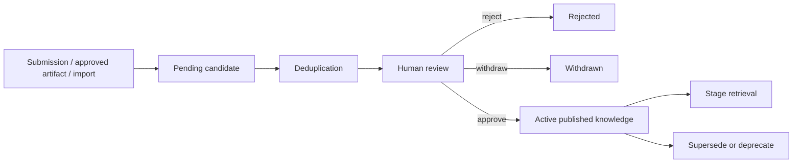

# Knowledge Lifecycle

```mermaid
flowchart LR
    S[Submission / approved artifact / import] --> C[Pending candidate]
    C --> D[Deduplication]
    D --> R[Human review]
    R -->|reject| X[Rejected]
    R -->|withdraw| W[Withdrawn]
    R -->|approve| P[Active published knowledge]
    P --> Q[Stage retrieval]
    P --> U[Supersede or deprecate]
```
