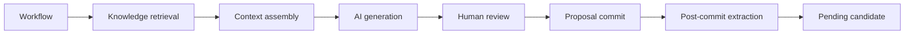

# Knowledge Workflow Integration

```mermaid
flowchart LR
    W[Workflow] --> R[Knowledge retrieval]
    R --> A[Context assembly]
    A --> G[AI generation]
    G --> H[Human review]
    H --> K[Proposal commit]
    K --> E[Post-commit extraction]
    E --> C[Pending candidate]
```

Knowledge retrieval is workflow-owned. AI and prompt runtimes receive only immutable `ContextPayload`.
