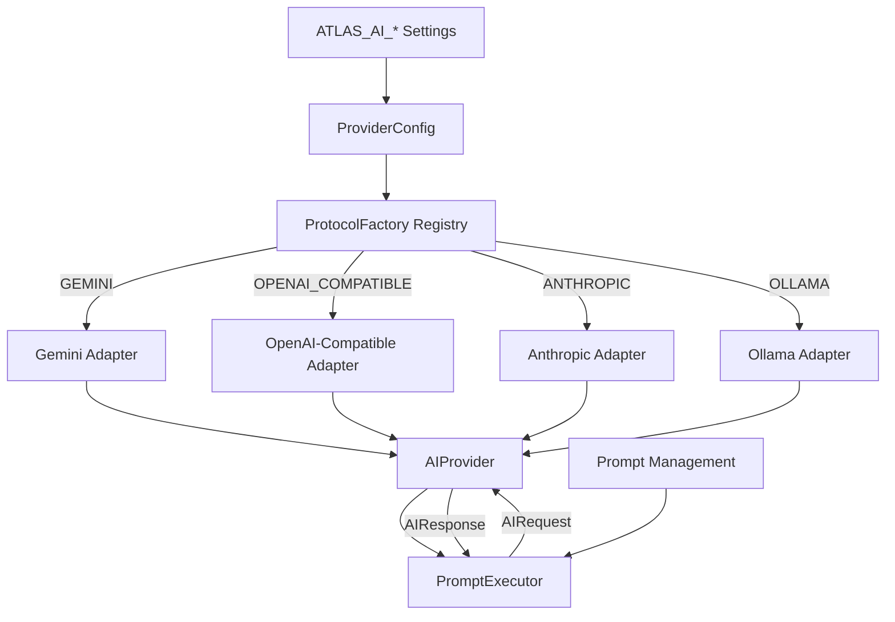

# Multi-Protocol AI Runtime Diagram

Bootstrap resolves the configured protocol once. Prompt execution depends only
on the `AIProvider` boundary.

Adding a protocol requires an adapter implementation plus factory registration.
Adding a vendor for an existing protocol requires configuration only.
