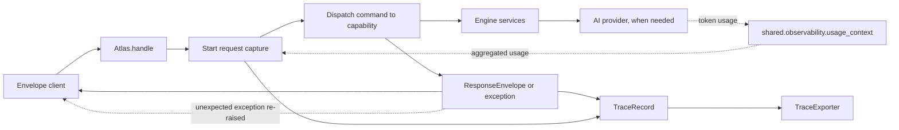

# Observed Platform Request

This diagram shows how request instrumentation surrounds the existing platform
dispatch path and how AI token usage crosses the `atlas`/`engine` boundary.

The exporter is best-effort. A failure to write or forward a trace is logged but
does not replace the response or the original exception.
