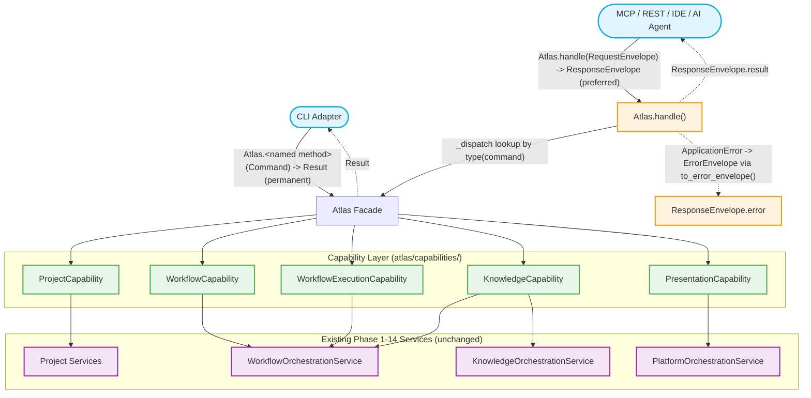

# Platform Request Dispatch Diagram (Phase 15)

This diagram shows the two valid paths through the Phase 15 platform layer: the permanent named-method path (in-process callers, e.g. the CLI) and the preferred envelope path (out-of-process/protocol adapters, e.g. MCP, REST, IDE, AI agents).

## Notes

- The named-method path (left) is unchanged from Phase 1-14 and remains permanently supported -- it is not a deprecated shim.
- `Atlas.handle()` is new in Phase 15. It looks up the exact `Command` subclass in an explicit literal `_dispatch` dict (ten entries), calls the matching capability method, and wraps the result (or a caught `ApplicationError`, via `to_error_envelope()`) in a `ResponseEnvelope`.
- Every capability delegates to the same engine services `Atlas` always used -- no new engine surface area is reachable through this diagram.

See also [Application Platform Diagram](application-platform.md), [Client Adapter Layer Diagram](client-adapter-layer.md), and the [Platform Layer architecture doc](../architecture/platform-layer.md).
