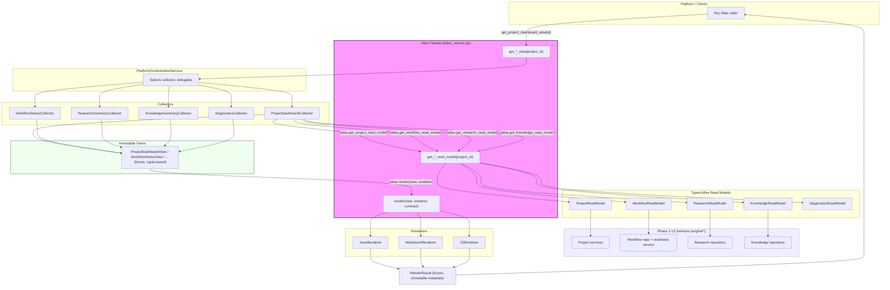

# Presentation Flow Diagram (Phase 14)

## Reading This Diagram

- **Rendering is a separate step from view retrieval.** A caller may fetch `get_project_dashboard_view` and never call `render` at all (e.g. to inspect the immutable view directly, as tests do).
- **Collectors are the only presentation code that talks to Atlas**, and only through the five `get_*_read_model` methods -- never through repositories, engine services, or the filesystem directly.
- **`Engine (Phase 1-13 Services)` is only reachable from inside the Atlas Facade box.** Nothing in `Collectors`, `Views`, or `Renderers` has an edge into it; this mirrors the static import-boundary guarantee enforced by `tests/architecture/test_presentation_boundaries.py`.
- **Views feed both `render` and callers directly** -- rendering is optional and always operates on the same immutable object a caller could inspect without rendering.

See [Presentation Layer Architecture](../architecture/presentation-layer.md) for the full write-up and [Presentation Extension Guide](../guides/presentation-extension-guide.md) for how to add a new view kind.
