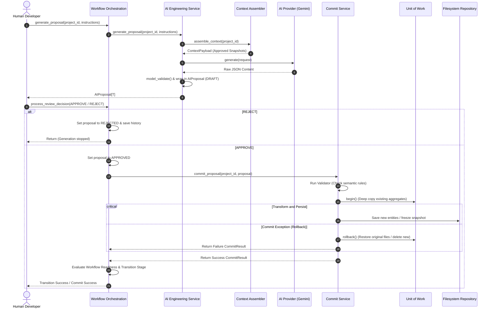

# Proposal Lifecycle Diagram

This sequence diagram illustrates the complete proposal lifecycle: from generation and draft validation, through human review approval, to filesystem commit with rollback support.

