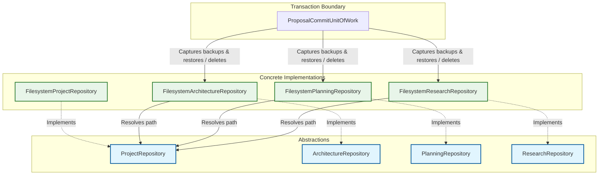

# Repository Dependency Inversion and Rollback Flow Diagram

This diagram illustrates how concrete repositories depend on abstract contracts, resolve their paths dynamically through `ProjectRepository`, and coordinate with the compensating unit of work rollback transaction.

