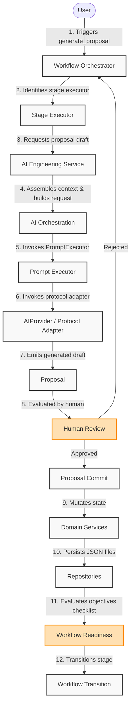

# Runtime Request Lifecycle Diagram

This diagram represents the step-by-step runtime request lifecycle of the ATLAS platform, detailing the flow from user action trigger, through generation, human review, commit processing, verification, and stage transition.

## Phase 15: Envelope Variant

For out-of-process/protocol adapters (MCP, REST, IDE, AI agents), step 1 above is instead: the adapter builds a `RequestEnvelope` (its `AdapterContext` + the Command) and calls `Atlas.handle(envelope)`. `Atlas.handle()` looks up the capability method for the enveloped Command's exact type via an explicit `_dispatch` table, invokes it, and wraps the outcome as a `ResponseEnvelope` (`result` on success, an `ErrorEnvelope` via `to_error_envelope()` if an `ApplicationError` was raised). From step 2 onward, the flow is identical -- the capability delegates to the same `WorkflowOrchestrationService` this diagram already shows. See [Platform Request Dispatch Diagram](platform-request-dispatch.md).
