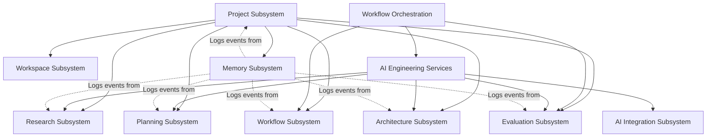

# Subsystem Interactions Diagram

This diagram illustrates how the core subsystems of ATLAS collaborate. The solid lines represent direct ownership or orchestration links, while the dotted lines show the Memory subsystem logging events as a cross-cutting concern.

